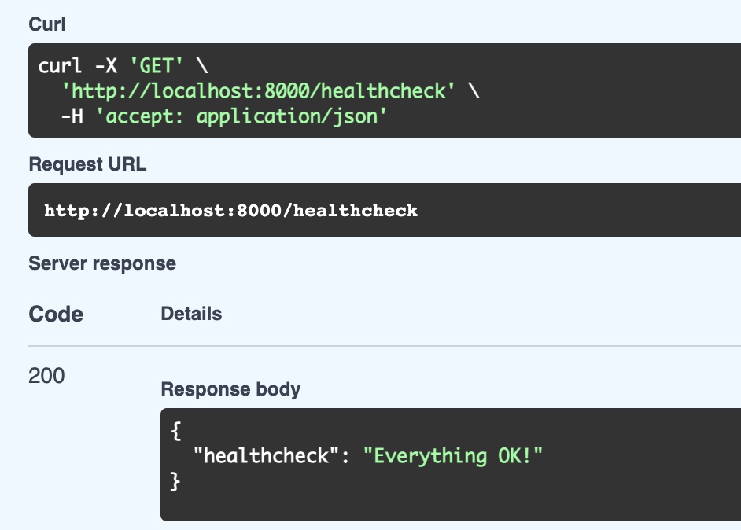
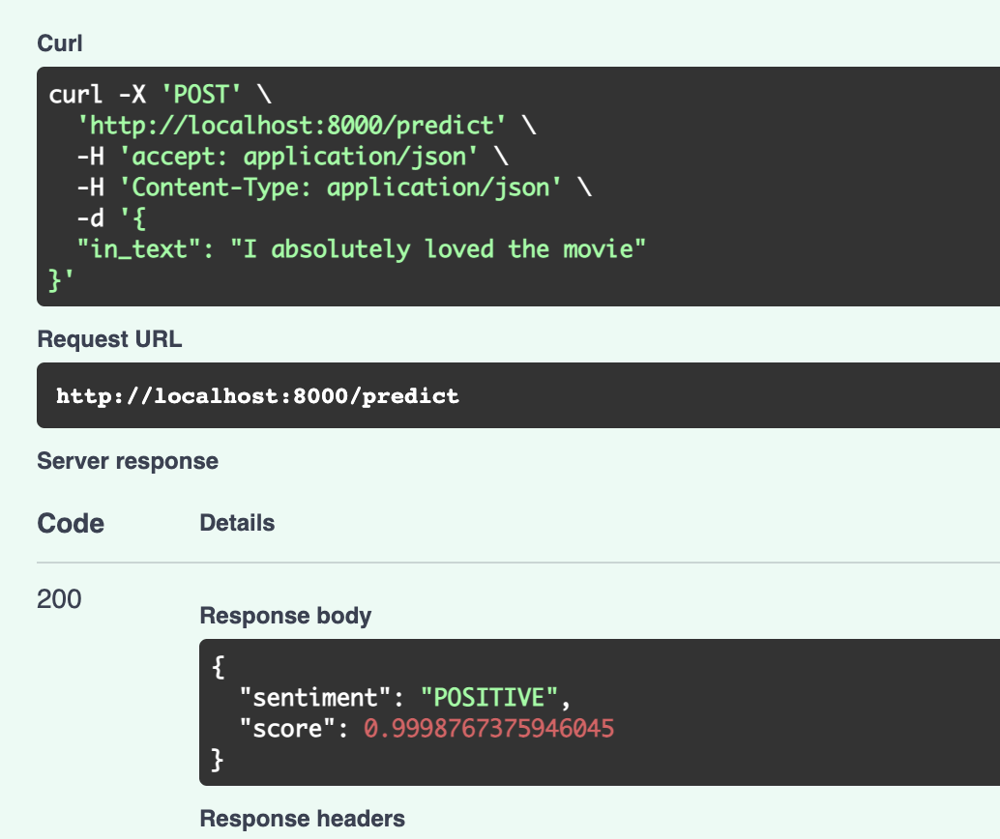
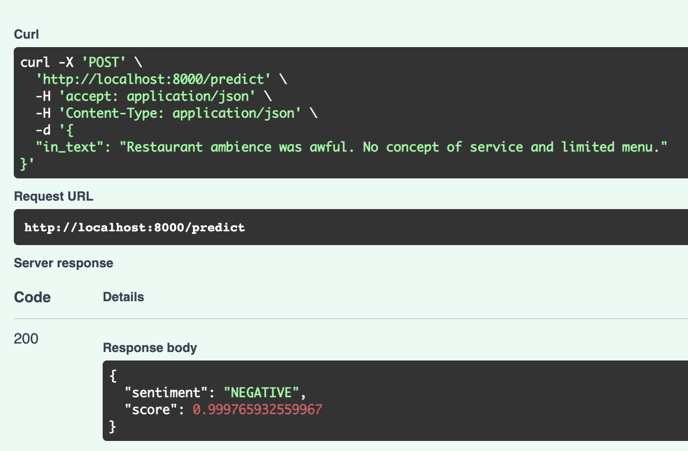
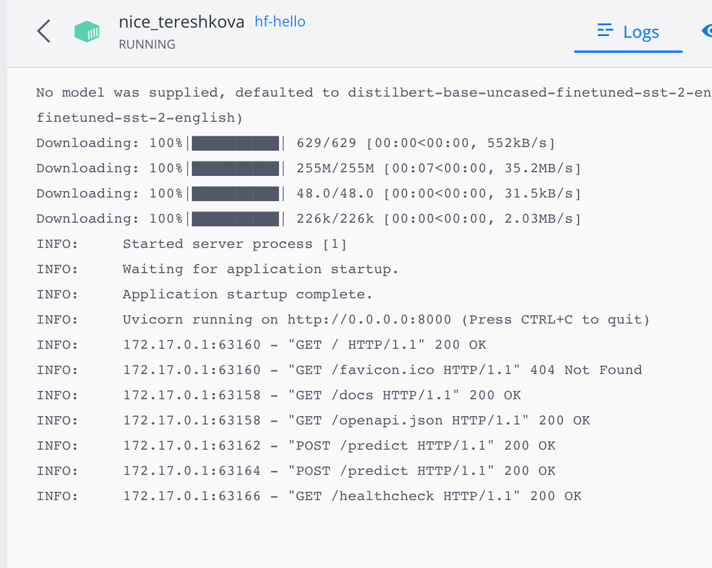
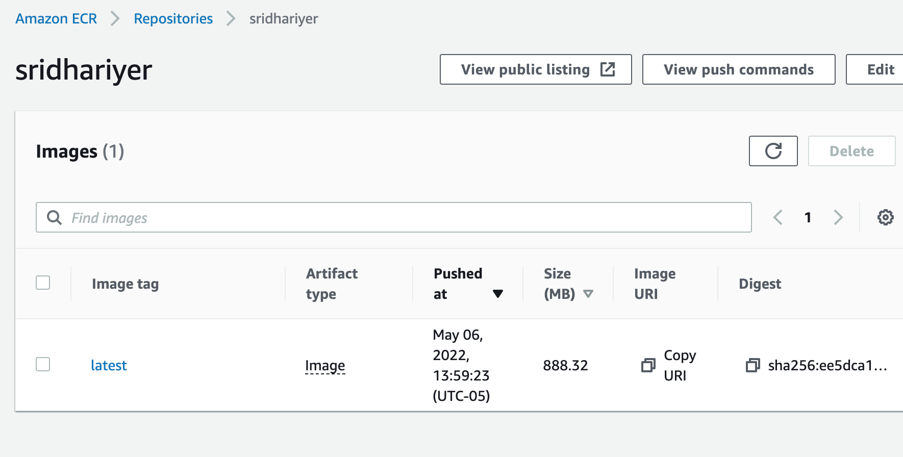

# MLOps3
Dockerized Sentiment Analysis Exercise

Running the basic healthcheck

Sentimentent analysis with a positive sample sentence.

Sentimentent analysis with a negative sample sentence.

Execution under docker (local machine) as viewed through Docker Desktop.

Error log inside docker execution!!

Image pushed to AWS registry.

